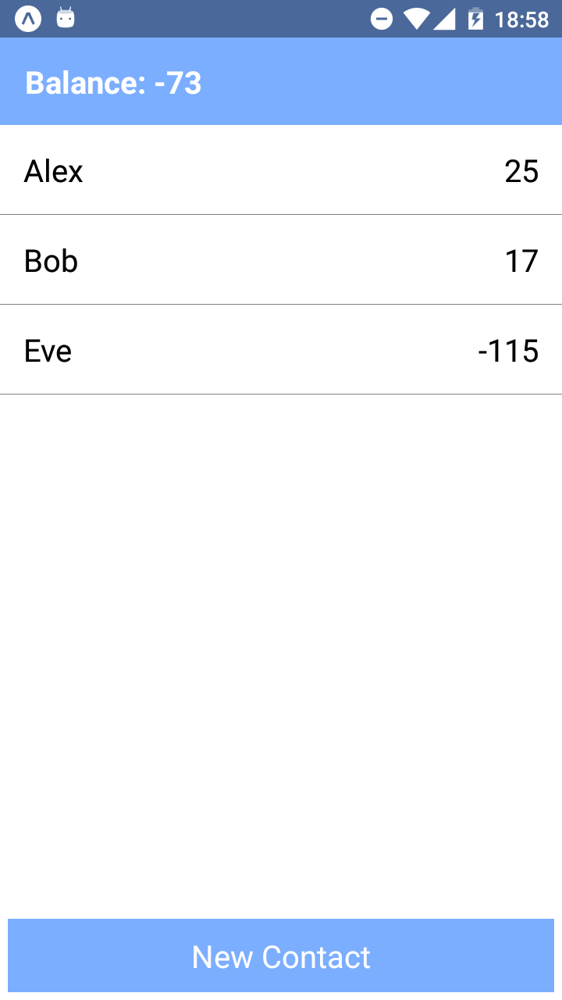
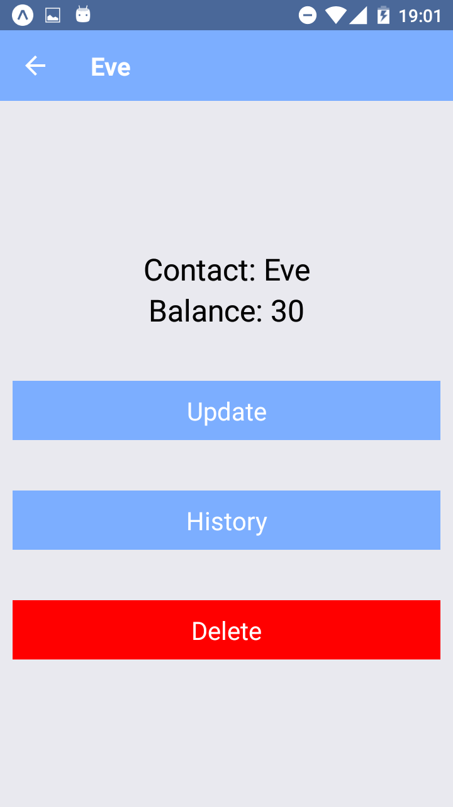
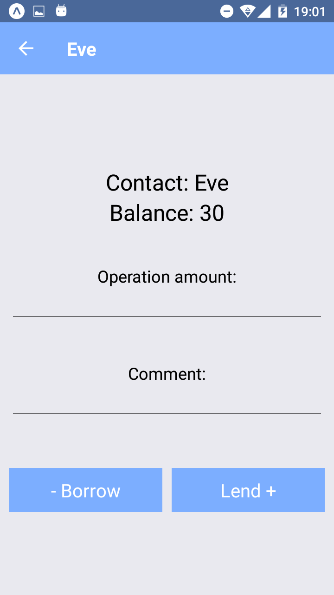
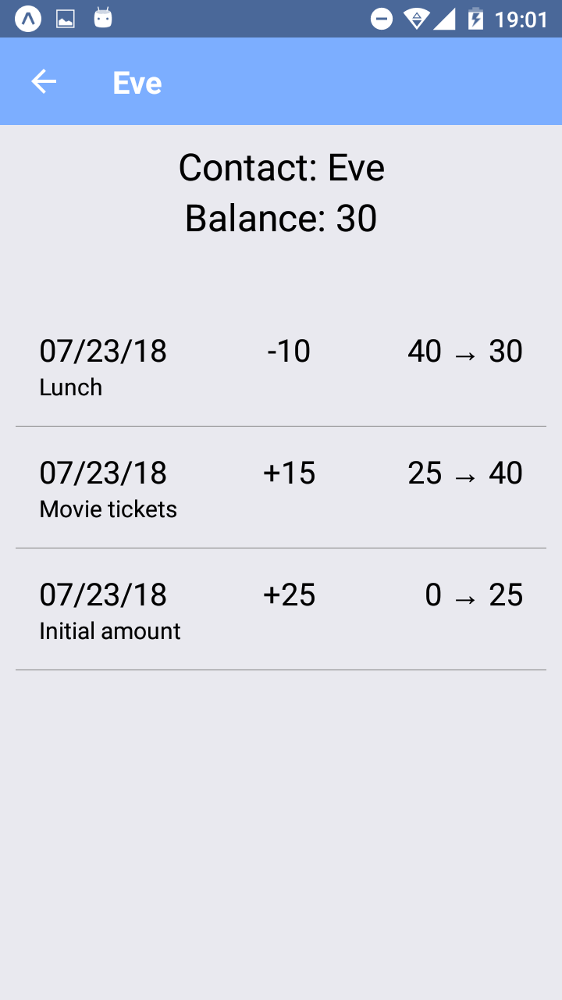
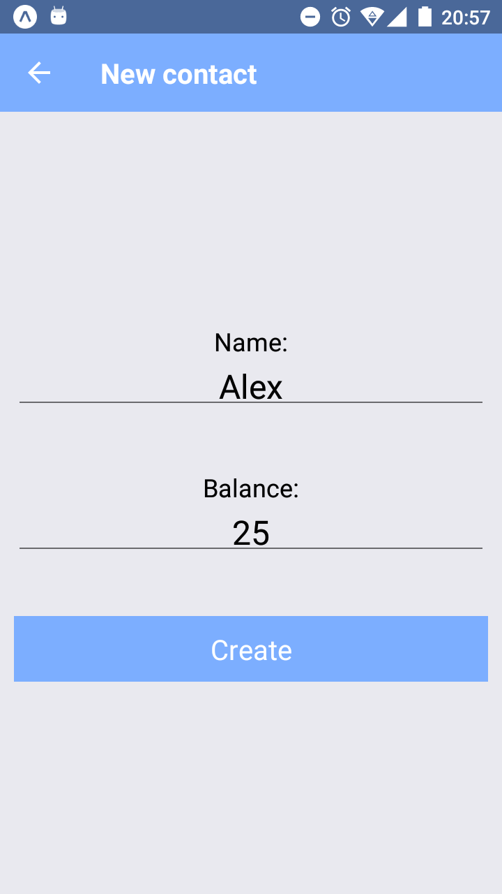

## React Native app for tracking debts

<p align="center">
  
  
  
  
  
</p>

App works offline, doesn't need access to phone contacts or internet access.

## Development

Connect phone with USB debugging mode and run in console

```
npm run android
```

Check [create-react-native-app](https://github.com/react-community/create-react-native-app) for full documentation.
